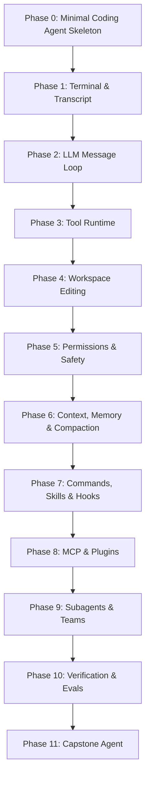

# Harness From Scratch

[简体中文](README.zh-CN.md)

A from-scratch curriculum for building a coding agent that reaches the practical core of Claude Code: terminal-first interaction, tool calling, repository editing, permission gates, context management, commands, skills, MCP integration, subagents, and verification.

The goal is not to clone Claude Code line by line. The goal is to understand the engineering shape well enough to build an open, teachable implementation that covers roughly 80% of the workflows a developer expects from a serious coding agent.

## How This Works

This repository follows the curriculum shape of [AI Engineering from Scratch](https://github.com/rohitg00/ai-engineering-from-scratch): phases, lessons, runnable code, narrative docs, and reusable outputs.

Each lesson should ship one concrete artifact:

- a runnable implementation in `code/`
- a focused lesson writeup in `docs/en.md`
- one reusable output in `outputs/`, such as a prompt, skill, agent definition, MCP server, or verification checklist

The curriculum is intentionally implementation-led. A lesson is complete only when the learner can run the feature locally and inspect the trace that proves it works.

## Curriculum Spine



## Repository Shape

```text
phases/<NN>-<phase-name>/
+-- README.md
+-- <NN>-<lesson-name>/
    +-- code/
    +-- docs/
    |   +-- en.md
    +-- outputs/

outputs/
+-- prompts/
+-- skills/
+-- agents/
+-- mcp-servers/

docs/
+-- reference-architecture.md
```

## Claude Code Reference Boundary

Claude Code source code is used as a public design reference for module boundaries and target behavior. This course studies the design ideas; it does not copy Claude Code implementation code.

When source-reading notes mention paths such as `src/query.ts`, treat them as conceptual anchors from Claude Code source-reading material. The main reference anchors are documented in [docs/reference-architecture.md](docs/reference-architecture.md).

## Target Capabilities

By the end of the curriculum, the learner should have a coding agent that can:

- run an interactive terminal session with persistent conversation state
- call an LLM through a typed message loop
- expose tools for shell commands, file reads, file edits, search, todo updates, and web or local resource access
- execute tool calls with streaming progress, structured errors, and traceable results
- enforce permission modes for filesystem and shell operations
- maintain a transcript and compact context when the conversation grows
- load slash commands, local skills, and lifecycle hooks
- discover external tools through MCP-style adapters
- spawn subagents with constrained tool access and isolated context
- verify changes with build, test, lint, direct functional checks, and adversarial probes
- run a capstone workflow that can inspect a repo, plan a change, edit files, run checks, and summarize the result

## Lesson Contract

Every lesson follows the same beats:

1. **Problem**: what breaks without this capability.
2. **Concept**: the smallest mental model needed.
3. **Build It**: implement the minimal version from scratch.
4. **Trace It**: inspect messages, tool calls, files, or process output.
5. **Harden It**: add only the failure handling required by the lesson.
6. **Ship It**: publish one reusable artifact.

Use [LESSON_TEMPLATE.md](LESSON_TEMPLATE.md) for new lessons and [ROADMAP.md](ROADMAP.md) for the planned sequence.

For a current self-review of the curriculum depth and remaining gaps, see [docs/course-content-review.md](docs/course-content-review.md).

## Run The Demos

Every phase includes a runnable TypeScript demo:

```bash
pnpm demo
```

To run one phase:

```bash
pnpm exec tsx phases/03-tool-runtime/code/demo.ts
```

The demos are intentionally small. They prove the chapter mechanism in isolation before the course combines those mechanisms into a larger coding agent.

## Start Here

Start with Phase 0 rather than jumping straight to tool calls. Phase 0 explains the minimal coding-agent loop: user input, transcript, model turn, tool action, observation, and verification. Once that loop is clear, Phase 1 implements the transcript-backed CLI shell that becomes the substrate for Phase 2 and every tool lesson after it.
