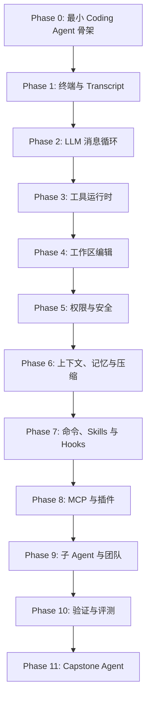

# Harness From Scratch

一个从零构建 coding agent 的课程。最终目标不是逐行复刻 Claude Code，而是通过可运行的 TypeScript 实战，理解并实现一个覆盖核心开发工作流的 agent：终端交互、LLM 消息循环、工具调用、仓库编辑、权限控制、上下文压缩、命令、Skills、MCP、子 Agent 和验证机制。

## 课程定位

这个仓库参考 [AI Engineering from Scratch](https://github.com/rohitg00/ai-engineering-from-scratch) 的组织方式：阶段、章节、可运行代码、课程文档和可复用产物。

每个章节都应该交付一个明确产物：

- `code/` 中的可运行 TypeScript demo
- `docs/en.md` 或对应中文文档中的课程说明
- `outputs/` 中的一个可复用产物，例如 prompt、skill、agent 定义、MCP server 或验证清单

课程以实现为主。一个章节只有在学习者能够本地运行 demo，并看到能证明机制有效的 trace 时，才算完成。

## 课程主线



## 仓库结构

```text
phases/<NN>-<phase-name>/
+-- README.md
+-- README.zh-CN.md
+-- code/
    +-- demo.ts

outputs/
+-- prompts/
+-- skills/
+-- agents/
+-- mcp-servers/

docs/
+-- reference-architecture.md
+-- reference-architecture.zh-CN.md
```

## Claude Code 参考边界

Claude Code 源代码只作为公开设计参考，用于理解模块边界和目标行为。本课程学习其设计思路，不复制 Claude Code 的实现代码。

当源码阅读笔记中提到 `src/query.ts` 等路径时，将其理解为来自 Claude Code 源码阅读材料的概念锚点。具体参考锚点见 [docs/reference-architecture.zh-CN.md](docs/reference-architecture.zh-CN.md)。

## 目标能力

完成课程后，学习者应该能实现一个具备以下能力的 coding agent：

- 运行带持久对话状态的交互式终端会话
- 通过类型化消息循环调用 LLM
- 暴露 shell、文件读取、文件编辑、搜索、todo 更新、本地资源访问等工具
- 执行工具调用，并输出流式进度、结构化错误和可追踪结果
- 对文件系统和 shell 操作执行权限控制
- 保存会话 transcript（对话记录），并在上下文增长时压缩历史
- 加载 slash command、本地 skill 和生命周期 hook
- 通过 MCP 风格 adapter 发现外部工具
- 启动带受限工具权限和隔离上下文的子 Agent
- 用 build、test、lint、功能检查和对抗性 probe 验证变更
- 完成一次 inspect repo -> plan -> edit -> verify -> summarize 的完整工作流

## 章节契约

每个章节遵循同一结构：

1. **Problem**：没有这个能力会出现什么具体问题。
2. **Concept**：理解该机制所需的最小模型。
3. **Build It**：从零实现最小版本。
4. **Trace It**：检查消息、工具调用、文件或进程输出。
5. **Harden It**：只补充本章需要的失败处理。
6. **Ship It**：沉淀一个可复用产物。

当前课程内容深度和待补齐项见 [docs/course-content-review.zh-CN.md](docs/course-content-review.zh-CN.md)。

## 运行 Demo

安装依赖：

```bash
pnpm install
```

运行全部章节 demo：

```bash
pnpm demo
```

运行单个章节：

```bash
pnpm exec tsx phases/03-tool-runtime/code/demo.ts
```

这些 demo 都刻意保持很小，用来先证明每章机制本身，再逐步组合成更完整的 coding agent。

## 从哪里开始

建议从 Phase 0 开始，而不是直接跳到工具调用。Phase 0 会先把 coding agent 的最小闭环讲清楚：用户输入、transcript、model turn、tool action、observation 和 verification。理解这个闭环后，再进入 Phase 1 实现 transcript-backed CLI shell。这里的 transcript 指 agent 的消息历史，不是 TypeScript。
